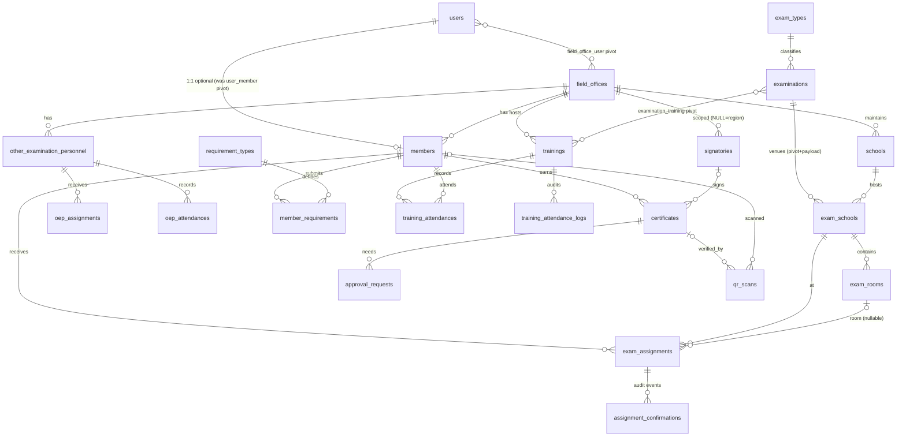

# PROCTAD Database Audit & Laravel 13 Migration Analysis

**Source:** `legacy_proctad_db.sql` (phpMyAdmin 5.2.2 dump, MariaDB 11.8.8, generated 2026-07-10)
**Database:** `u390694310_cscro8` — PROCTAD Management System, CSC Regional Office VIII
**Target stack:** Laravel 13 + Vue 3 + Inertia.js + Tailwind CSS
**Scope:** 42 table definitions, 2 triggers, 36 FK constraint groups, ~7,300 lines

---

## 1. Executive Summary

The database is in **better shape than most legacy PHP/PDO systems**: InnoDB throughout, utf8mb4, real foreign keys with sensible cascade rules, heavy (sometimes excessive) indexing, and `created_at`/`updated_at` on most business tables. The core domain model — members, examinations, schools, assignments, trainings, certificates — is sound and maps cleanly to Eloquent.

The problems cluster in five areas:

1. **A foreign, shared legacy user table** (`users_cscro8`) imported from a wider CSC system, with zero-dates, empty-string enum values, unenforced FKs, and ~40 accounts sharing an identical bcrypt hash (a default password never changed).
2. **Duplicated workflow state** — `proctad_school_assignments` and `proctad_service_history` store overlapping copies of the same assignment lifecycle; `proctad_config` duplicates `proctad_system_settings`; `training_records.linked_exam_id` duplicates the `proctad_exam_training` pivot; `is_published`/`is_archived`/`status` on examinations encode overlapping state.
3. **Hand-rolled framework plumbing** (rate limiting, login throttling, password reset tokens, OAuth state, notifications, DB triggers) that Laravel replaces natively — 7 tables and 2 triggers can be deleted outright.
4. **Security issues**: plaintext SMTP credentials in the database (and now in this dump file on disk), plaintext confirmation tokens, unhashed default passwords, PII (birthdays, contact numbers) without a protection strategy.
5. **Three orphan "view snapshot" tables** with no primary keys — materialized reporting queries exported as tables.

**Data note:** the dump contains no rows for `proctad_members` — confirmed by the owner as **intentional** (this dump is a schema/analysis reference; member PII was excluded). The full members data lives in production and must be part of the real ETL source. This reference dump cannot be restored with FK checks on, which is expected.

**Verdict:** migrate with a *restructure-in-flight* strategy — keep the domain model, drop the plumbing, consolidate the duplicated workflow state, and rebuild the user table. Roughly: 14 tables keep (light renames), 8 modify, 3 merge/consolidate, 12 remove/replace with Laravel features, 1 split (eligibility requirements).

---

## 2. Database Health Assessment

| Dimension | Grade | Notes |
|---|---|---|
| Referential integrity | B | Real FKs with cascades on most tables; missing on `nep_attendance`, `examinations.created_by/field_office_id`, all of `users_cscro8`'s references |
| Naming | C+ | Consistent `proctad_` prefix but singular/plural mixed; two columns named `school_id` that actually reference `exam_schools` |
| Timestamps | B+ | Most tables have both; a few have only `created_at` |
| Soft deletes | C | Only `school_assignments` and `service_history` have `deleted_at` |
| Indexing | B− | Comprehensive, but 4 exact duplicate indexes and `service_history` is over-indexed (13 indexes) |
| Data types | B | Appropriate mostly; `qr_code TEXT` for a file path, `int(11)` signed vs `int(10) unsigned` FK mismatches |
| Security | D | Plaintext SMTP password, shared default password hash, plaintext tokens, zero-dates |
| Laravel readiness | C+ | Enum-heavy, business-key PKs on 2 tables, framework plumbing to shed |

---

## 3. Table-by-Table Analysis

Legend: **KEEP** (as-is / rename only) · **MODIFY** · **MERGE** · **SPLIT** · **REMOVE** · **REPLACE** (Laravel feature)

### 3.1 Identity & Access

#### `users_cscro8` → **rebuild as `users` (MODIFY, heavily)**
Legacy staff table shared with a wider CSC system (`itg_id`, `fo_rsu`, `type` = division codes).
Issues:
- `fname`/`lname`/`mname` **and** `minitial` (derivable — drop `minitial`).
- `sex enum('Male','Female','')` — empty string as enum member; two rows have `role = ''` (inserted under non-strict SQL mode). Laravel/strict MySQL will reject these.
- `first_day` and `birthday` contain `'0000-00-00'` — invalid under strict mode; must be converted to `NULL` during ETL.
- `exam_fo_id int(12)` has values 0–7 with **no FK** and duplicates the `proctad_user_field_office` pivot. **Decision: drop it** — the pivot is the single source for staff↔field-office mapping.
- `must_change_password`, `failed_login_attempts`, `locked_until` — keep; these are legitimate, but reimplement lockout via Laravel rate limiting + these columns.
- **~40 of 60 users share the same bcrypt hash** (`$2y$10$RhXcMiZi…`) — a default password. Force reset on first login in the new system.
- `status varchar(36)` ('Active'/'Inactive') and `type varchar(12)` (division code) → `status` becomes a PHP enum-backed string or `is_active` boolean; `type` becomes a `division` FK/lookup if divisions matter, else keep as string.
- Rows 50/52 and 21/53 are **duplicate people** with two accounts for two field offices (`rbuy-esamar` / `rbuy-samar`) — an artifact of single-office membership; the `user_field_office` pivot already solves this. Deduplicate during ETL.

New shape: standard Laravel `users` (`id` bigint, `name` parts, `email`, `username`, `password`, `role`, `is_active`, `must_change_password`, `locked_until`, `remember_token`, timestamps, `deleted_at`).

#### `proctad_user_member` → **REPLACE with `members.user_id` column**
Pivot with `UNIQUE(user_id, proctad_id)`; data shows strictly one member per user — a disguised **one-to-one**. Put a nullable, unique `user_id` FK on `members` instead. A pivot table for a 1:1 adds a join to every query for no benefit.

#### `proctad_user_field_office` → **KEEP as pivot `field_office_user`**
Genuine many-to-many capability (staff overseeing offices). Rename to Laravel convention (`field_office_user`), add timestamps, keep the composite unique. Clarify against `users.exam_fo_id` (likely dead — see above).

### 3.2 Core Domain — People

#### `proctad_members` → **`members` (MODIFY)**
The heart of the system. PK is `proctad_id varchar(20)` (business key `PROCTAD-2026-XXXXX`).
- **Recommendation: surrogate `id` bigint PK + `code` (the PROCTAD ID) as a unique column.** Business-key PKs are fanned out as varchar(20) FKs across 8 child tables — wasteful and brittle (a re-issued ID would cascade everywhere). Keep the code for display/QR.
- `id_status varchar(50)` ('ACTIVE'/'INACTIVE' for the physical ID card) overlaps conceptually with `accreditation_status` enum — keep both only if the app really tracks card status separately; rename to `card_status` for clarity.
- `qr_code TEXT` stores a file path — change to `varchar(255)`; the current prefix index `qr_code(255)` exists only because TEXT can't be fully indexed.
- `google_id` + `last_login` → members log in via Google OAuth. **Decision: Member is a second authenticatable model on its own `member` guard** (staff and members must never share a login path). Add `remember_token`; authenticate via Socialite; no password column.
- `disqualification_reason/date` — fine as nullable columns.
- Add `deleted_at` (members are legally significant; never hard-delete).
- **No rows in dump** — see Executive Summary.

#### `proctad_non_exam_personnel` → **`other_examination_personnel` (KEEP, minor)**
Near-clone of `members` (name parts, gender, contact, agency, QR, photo, statuses) for coordinators/inspectors/janitors/etc.
- **Do not merge with members.** Different lifecycle (no accreditation, no training, no certificates), different ID series (`NEP-2026-…`), different assignment rules. Merging would nullable-poison a unified table.
- Same fixes as members: surrogate `id` + unique `code`, `personnel_type` enum → string + PHP enum (adding a personnel type today requires DDL — that's a design smell), `qr_code` → varchar.
- Data shows duplicate rows (NEP-00035/00036 same person, same day-apart) — no natural-key unique constraint exists; consider `UNIQUE(first_name, last_name, birth?)` is too strict, but add app-level duplicate detection.

#### `proctad_eligibility_requirements` → **SPLIT / normalize to `member_requirements`**
Seven hardcoded requirement pairs (`permanent_employment` + `_file`, `intent_to_serve` + `_file`, …). Classic repeating-group violation (1NF): adding requirement #8 = schema change; querying "all pending requirements" = 7-way CASE.
Normalize to:
- `requirement_types` (id, code, name, is_active) — seed with the current 7.
- `member_requirements` (id, member_id, requirement_type_id, status ['pending','complied','not_complied'], file_path, reviewed_by, timestamps, `UNIQUE(member_id, requirement_type_id)`).

Table is empty in the dump, so this split costs nothing.

### 3.3 Core Domain — Examinations

#### `proctad_exam_types` → **`exam_types` (KEEP)** — clean lookup. Add `updated_at`.

#### `proctad_examinations` → **`examinations` (MODIFY)**
- Three overlapping state fields: `status` enum (draft/published/upcoming/ongoing/completed/cancelled), `is_published`, `is_archived`. `upcoming/ongoing/completed` are **derivable from `exam_date`** — storing them invites stale state. Recommend: keep `status` limited to lifecycle the user controls (`draft`,`published`,`cancelled`), keep `is_archived` (or `archived_at`), drop `is_published` (== `status = 'published'`).
- `created_by int(10) unsigned` — **no FK** (and type-mismatched with `users.id int(12)` signed). Add FK.
- `field_office_id` — indexed but **no FK**; add (`scope`='field-office-specific' ⇒ non-null; enforce in app/DB check).
- Missing `updated_at` — add.
- `manual TEXT` (path to exam manual PDF) → `varchar(255)`.

#### `proctad_schools` → **`schools` (KEEP)**
Venue master list per field office. Add `updated_at`. Data shows `''` (empty string) rather than NULL in contact fields — normalize to NULL in ETL. `municipality varchar(50)` is tight but adequate.

#### `proctad_exam_schools` → **`examination_school` pivot-with-payload (MODIFY)**
Links an exam to venue schools with `assigned_by`, `status`.
- **Missing `UNIQUE(exam_id, school_id)`** — the same school can be attached to the same exam twice. Add it.
- Duplicate index: `idx_status` and `idx_school_status` are both on (`status`) — drop one.
- `assigned_by` has no FK — add.
- Keep as a real model (`ExamSchool` / `ExaminationVenue`), not a bare pivot — three tables hang off its PK.

#### `proctad_exam_rooms` → **`exam_rooms` (MODIFY — fix misleading FK)**
- **`school_id` actually references `proctad_exam_schools.exam_school_id`**, not `schools` (constraint `fk_rooms_to_schools`). Rename to `exam_school_id`. This is a latent bug factory — any developer will join it to `schools`.
- `exam_id` is **redundant** — derivable through `exam_schools.exam_id`. Either drop it or keep it denormalized *with* a composite FK; recommend dropping (row counts are small; the join is cheap).
- Rooms are per-exam-per-school occurrences (1,010 rows for 2 exams) — correct design for this domain; keep.

#### `proctad_exam_training` → **`examination_training` pivot (KEEP, rename)**
Pure M:N between trainings and exams, already has `UNIQUE(training_id, exam_id)`. Convert to a Laravel pivot (drop surrogate `id` or keep — Laravel is fine either way). **Simultaneously drop `training_records.linked_exam_id`** (all NULL in data — the pivot superseded it; the column is dead).

### 3.4 Assignments & Service — the biggest redesign

#### `proctad_school_assignments` + `proctad_service_history` → **consolidate**
These two tables describe the **same event** — "member X serves at exam Y, school Z, in role R" — and the legacy app writes both:
- `school_assignments`: school_id (→exam_schools! same misnaming as rooms), exam_id, proctad_id, role, room, `assignment_status` (pending/confirmed/declined/cancelled), `confirmed_at`, `deleted_at`.
- `service_history`: proctad_id, exam_date, exam_type_id, exam_id, school_id (→exam_schools), role_performed, field_office_id, `attendance_confirmed`, `confirmation_status`, **plus the whole email-confirmation machinery** (token, sent_at, confirmed_at, ip, user_agent, decline_reason, token_expires_at), `deleted_at`.

Redundancies: role, exam, school, member, confirmation status, confirmed_at all duplicated; `exam_date`, `exam_type_id`, `field_office_id` in service_history are denormalized copies of what the exam row already knows. Row counts are near-identical (258 vs 257 auto-increment) — confirming 1:1 duplication.

**Recommended target:**
- **`exam_assignments`** (one row per member-per-exam-per-school): member_id, exam_school_id, exam_room_id (nullable), role, status (pending/confirmed/declined/cancelled/expired), confirmed_at, declined_reason, attendance fields (attended_at, attendance_confirmed), timestamps, deleted_at, `UNIQUE(member_id, exam_school_id)`.
  - Note the legacy unique `UNIQUE(school_id, proctad_id)` **omits exam_id** — it works only because exam_school_id is already exam-specific. Preserve that insight: uniqueness on (member, exam_school).
- **`assignment_confirmations`** (from `proctad_assignment_confirmations`, KEEP): append-only audit of sent/confirmed/declined/reminder/expired/override events, with token, ip, user_agent, metadata JSON. Move `confirmation_token`/ip/user_agent **out of** the assignment row into this log + a `confirmation_tokens`-style column pair on the assignment (hashed token + expiry) — or sign the URL instead (see below).
- **Confirmed: "service history" becomes a query, not a table** — its purpose is counting/listing a member's service across conducted examinations, which derives directly from confirmed assignments on completed exams (`Member::serviceHistory()` scope). `certificates.service_id` is remapped to `certificates.exam_assignment_id` during ETL.

Laravel bonus: the confirm/decline email links should become **signed URLs** (`URL::temporarySignedRoute`) — the token columns, expiry tracking, and manual validation code all disappear.

#### `proctad_nep_school_assignments` → **`oep_assignments` (MODIFY)**
Mirror of member assignments for OEPs. Keep separate (different entity, simpler lifecycle — no confirmation workflow). Fix: `field_office_id` is a denormalized copy (derivable via OEP) — drop or accept consciously. Note its `school_id` references `schools` directly (unlike member assignments which go through exam_schools) — an inconsistency; align both on `exam_school_id` if OEPs are always at exam venues.
**Polymorphic alternative** (one `assignments` table with `assignable_type/assignable_id` for Member|OtherExaminationPersonnel): viable, but the member workflow carries confirmation state OEPs don't have; separate tables are simpler and constraint-friendly. Not recommended.

#### `proctad_nep_attendance` → **`oep_attendances` (MODIFY)**
Has unique (oep, exam, school) and index keys — but **no FK constraints at all** (the ADD CONSTRAINT block is absent). Add FKs to other_examination_personnel, examinations, schools, users(scanned_by).

### 3.5 Training

#### `proctad_training_records` → **`trainings` (MODIFY)**
- Drop `linked_exam_id` (dead — superseded by pivot, all NULL).
- `training_type varchar(50)` default 'TEA' — every row is 'TEA'; keep as string with PHP enum, or drop if single-valued forever.
- Data anomaly: `training_time_end = '00:00:00'` on row 14 (meant as "unknown") — normalize to NULL in ETL.

#### `proctad_training_attendance` → **`training_attendances` (MODIFY)**
- Good unique (training_id, proctad_id).
- **Redundant column pair:** `qr_scanned_at` (always NULL in data) vs `qr_scan_timestamp` (used) — drop `qr_scanned_at`. Likewise `recorded_by` vs `scanned_by` overlap (manual vs QR recorder) — collapse to one `recorded_by` + `scan_method`.
- `time_in`/`time_out` as TIME while `qr_scan_timestamp` is TIMESTAMP — `time_in` duplicates the timestamp's time part in every row. Keep the timestamp, derive display time.

#### Triggers `trg_attendance_log_after_insert/update` → **REPLACE with Eloquent observers**
They mirror QR check-ins into the log table. In Laravel, a `TrainingAttendanceObserver` (or domain event) does this transparently, testably, and visibly in code. **Do not port DB triggers** — they're invisible to the ORM and caused the duplicate log rows visible in the data (trigger writes a bare row, app writes an enriched row with qr_data/ip — every scan is logged twice).

#### `proctad_training_attendance_logs` → **`training_attendance_logs` (KEEP as audit)**
Append-only audit trail; keep. Deduplicate the trigger-vs-app double rows during ETL (keep the enriched ones). `qr_data` prefix index is fine; consider JSON column type.

### 3.6 Certificates & Approvals

#### `proctad_certificates` → **`certificates` (KEEP, minor)**
Well-designed: unique certificate_number, snapshot of signatory name/position (correct historical-record denormalization — keep it), approval workflow fields, email tracking, full FK coverage.
- `certificate_type` / `approval_status` enums → strings + PHP enums.
- `qr_code TEXT` → varchar path.
- ~1,290 rows; largest business table. Migrates as-is.

#### `proctad_approval_requests` → **`approval_requests` (KEEP)**
Routing/approval queue for certificates (approver_role: management|field_office). Sound. If other approvables ever appear (e.g., eligibility docs), this is your **polymorphic candidate** (`approvable_type/id`) — but don't do it speculatively; today it's certificate-only.

#### `proctad_signatories` → **`signatories` (KEEP)** — clean. `active_status` → `is_active`.

#### `proctad_qr_scans` → **`qr_scans` (KEEP as audit log)**
Verification/scan audit. Data shows **inconsistent QR payload formats** (`'7|attendance'` numeric vs `'PROCTAD-2026-B63F9|attendance'`) — a legacy client bug; standardize payload format in the new app, keep old rows as-is.

### 3.7 Communication

#### `proctad_email_logs` → **`email_logs` (KEEP)** — useful operational audit; Laravel mail events can populate it.
#### `proctad_email_templates` → **`email_templates` (KEEP only if admins edit templates)**
**Confirmed: admins edit templates at runtime — the table stays.** Render through a template service (replace `{placeholders}` from the variables JSON) inside Mailables. Drop the duplicate index (`template_code` unique + `idx_template_code`).
#### `proctad_notifications` → **REPLACE with Laravel `notifications` table**
Column-for-column match with Laravel's native notifications (type, notifiable, data JSON, read_at). Zero rows lost (table is empty in dump). Delete.

### 3.8 Settings

#### `proctad_system_settings` + `proctad_config` → **MERGE into `settings`**
Two key-value stores doing the same job (`config` holds `active_letter_head`, `default_member_status`). Merge into one `settings` table (key, value, type, is_public, updated_by).
- **Move SMTP credentials out of the database entirely** → `.env` / `config/mail.php`. If runtime-editable SMTP is genuinely required, store with Laravel's `encrypted` cast. **The current `smtp_password` is plaintext — and this dump file has now spread it to your project root. Rotate that Gmail app password.**
- `active_letter_head` stores a **filename string** pointing at `proctad_letter_head.filename` — a string-typed foreign key. Replace with an `is_active` flag on letterheads (below).

#### `proctad_letter_head` → **`letterheads` (MODIFY)**
Add `is_active boolean` (single active enforced in app), drop the config-key indirection. `user_id` → `uploaded_by`.

### 3.9 Framework plumbing — REMOVE (Laravel natives)

| Legacy table | Laravel replacement |
|---|---|
| `proctad_api_rate_limit` | `RateLimiter` (cache-backed) / `throttle` middleware |
| `proctad_login_attempts` | Fortify/rate limiter |
| `proctad_failed_login_attempts` | rate limiter + keep `users.failed_login_attempts`/`locked_until` if you want persistent lockout; log events to `security_logs` |
| `proctad_ip_blacklist` | middleware + cache, or keep as a tiny `blocked_ips` table if admin-managed — data is empty, so likely delete |
| `proctad_password_reset_tokens` | Laravel's `password_reset_tokens` (built-in, hashed tokens) |
| `proctad_oauth_state` | Socialite keeps state in the session. Table has AUTO_INCREMENT=6909 of pure garbage that was never purged — a monument to why this belongs in sessions. Delete. |
| `proctad_notifications` | native `notifications` |

Plus Laravel-required new tables: `sessions`, `cache`, `jobs`/`failed_jobs`, `personal_access_tokens` (if API tokens needed).

#### `proctad_security_logs` → **`activity_logs` (KEEP or adopt spatie/laravel-activitylog)**
657 rows of structured JSON event data — valuable. Spatie's package gives you the same shape (`causer`, `event`, `properties` JSON) with ecosystem support; migrate rows into it, or keep the table as-is with a slim model.

### 3.10 View-snapshot tables — REMOVE

`proctad_member_attendance_history`, `proctad_school_statistics`, `proctad_training_attendance_stats` — no PKs, no indexes, view-shaped types (`decimal(29,2)`, `decimal(23,0)`), zero rows. These are materialized reporting queries (or phpMyAdmin view-as-table exports). In Laravel: Eloquent aggregate queries, or real MySQL views, or cached dashboard queries. **Do not migrate.**

---

## 4. Relationship Map → Eloquent

**Eloquent model inventory (~20 models):** User, FieldOffice, Member, OtherExaminationPersonnel, RequirementType, MemberRequirement, ExamType, Examination, School, ExamSchool, ExamRoom, Training, ExamAssignment, AssignmentConfirmation, OepAssignment, OepAttendance, TrainingAttendance, TrainingAttendanceLog, Certificate, ApprovalRequest, Signatory, QrScan, EmailLog, EmailTemplate, Letterhead, Setting, ActivityLog.

**Relationship corrections found:**
- `exam_rooms.school_id` and `school_assignments.school_id` **do not reference `schools`** — they reference `exam_schools`. Rename both to `exam_school_id`.
- `user_member` pivot is a disguised 1:1 → column.
- `training_records.linked_exam_id` is a dead duplicate of the exam_training pivot.
- Missing FKs: `nep_attendance.*` (all four), `examinations.created_by`, `examinations.field_office_id`, `exam_schools.assigned_by`, `users.exam_fo_id`, `other_examination_personnel.created_by`, `notifications.reference_id` (polymorphic-ish, un-enforceable — fine).
- No circular dependencies. Certificates↔approvals↔users is acyclic.
- **Orphan risk:** every table referencing `proctad_members` is orphaned in this dump (no member rows). Also `qr_scans` ON DELETE SET NULL on a NOT-NULL-looking business flow is fine but means scans can lose their member link.

---

## 5. Performance Review

**Duplicate indexes (drop the redundant one):**
- `email_templates`: `template_code` (unique) + `idx_template_code`
- `ip_blacklist`: `ip_address` (unique) + `idx_ip_address`
- `password_reset_tokens`: `token` (unique) + `idx_token`
- `exam_schools`: `idx_status` + `idx_school_status` (both on `status`)

**Over-indexing:** `service_history` has 13 indexes; `training_attendance` has 8. Every low-cardinality enum got its own index (`idx_status`, `idx_attendance`, `idx_scan_method`) — these rarely help and tax writes. In the new schema, index FK columns + genuinely selective columns (tokens, dates, composite (member_id, exam)) and drop single-column enum indexes unless a query proves the need.

**Data types:**
- `qr_code TEXT` on members/OEP/certificates stores file paths → `varchar(255)` (also removes prefix-index hacks).
- `int(10) unsigned` PKs everywhere except `users_cscro8.id int(12)` signed and several `int(11)` signed FK columns pointing at unsigned PKs — MariaDB tolerates it; Laravel migrations will standardize on `unsignedBigInteger`/`foreignId`.
- Snapshot decimal types (`decimal(29,2)`) exist only in the view-snapshot tables being deleted.

**N+1 hotspots to design for** (Inertia pages): assignment rosters (member→assignments→room→exam_school→school→exam — eager-load the chain), certificate lists (member + signatory + approver), dashboards (use aggregate queries, not the snapshot tables).

**Volume:** everything is small (largest: certificates ~1.3k, attendance logs ~1.1k, exam_rooms ~1k). No partitioning/storage concerns; optimize for correctness, not scale.

---

## 6. Security Review

| Severity | Finding | Action |
|---|---|---|
| **Critical** | `smtp_password` plaintext in `system_settings` — and now in this dump in your webroot | Move to `.env`; **rotate the Gmail app password**; ensure the .sql is not web-accessible or committed to git |
| **High** | ~40 users share one bcrypt hash (default password), `must_change_password=0` | Force password reset for all on cutover; enable `must_change_password` semantics via middleware |
| Medium | Confirmation tokens stored plaintext in `service_history` | Replace with Laravel signed URLs (preferred) or hashed tokens |
| Medium | `password_reset_tokens.token` plaintext | Laravel's native table stores hashed tokens — free fix |
| Medium | Zero-dates (`0000-00-00`) in users | Convert to NULL in ETL; strict mode will reject them |
| Medium | Empty-string enum members (`sex`, `role`) | Clean in ETL; use nullable + PHP enums |
| Low/PII | Birthdays, contact numbers, emails of members & staff | Access-scope by field office (Policies), consider `encrypted` cast for birth_date/contact if compliance (RA 10173 Data Privacy Act) requires; add audit logging on member profile access |
| Low | `user_agent`/`ip_address` retained indefinitely in 6 log tables | Add pruning policy (`model:prune`) |

---

## 7. Laravel Conventions & Improvements

- **Naming:** the `proctad_` prefix **stays on the physical tables** — the production database is shared by multiple systems and the prefix is how tables are attributed to this app. Implement it as a Laravel **connection prefix** (`'prefix' => 'proctad_'` in `config/database.php`), not by hardcoding it: migrations write `Schema::create('members', …)` and models need no `$table` overrides, while the server sees `proctad_members`. Laravel's own tables (`migrations`, `sessions`, `cache`, `jobs`, `notifications`) get prefixed automatically — exactly right for a shared database. Caveat: raw SQL bypasses the prefix, so prefer the query builder/Eloquent. Beyond that: plural snake_case tables, `id` PKs, `{model}_id` FKs. Pivots: `examination_training`, `field_office_user`. Bonus: `users_cscro8` becomes `proctad_users`, finally consistent with the rest.
- **Primary keys:** `id()` (bigint unsigned) everywhere; business codes (`PROCTAD-2026-…`, `OEP-2026-…`, certificate numbers) as unique varchar columns. **UUID/ULID not recommended** — internal admin system, no distributed ID generation, no ID-guessing exposure worth the index cost. The QR/URL-facing artifacts (certificates, confirmations) should use signed URLs, which solves enumeration without ULID PKs.
- **Enums:** convert all MySQL ENUMs to `varchar` + PHP backed enums with Eloquent casts. Rationale: ~25 ENUM columns exist; several already show why DB enums hurt (empty-string members, `personnel_type` needing DDL to extend, overlapping status vocabularies).
- **Timestamps:** add `updated_at` where missing (exam_types, schools, examinations, qr_scans stays created-only as an immutable log — use `const UPDATED_AT = null`).
- **Soft deletes:** members, other_examination_personnel, users, certificates, exam_assignments, trainings, examinations. Not on append-only logs.
- **Cascades:** the legacy rules are mostly right (CASCADE on owned children, SET NULL on attributions). Preserve them in migrations. One review point: `certificates ON DELETE CASCADE from members` — certificates are legal records; with soft deletes on members this FK rarely fires, but consider RESTRICT to be safe.
- **JSON columns:** `metadata` (assignment_confirmations), `details` (security_logs), `variables` (email_templates), `qr_data` (attendance logs) → `json` type + `array` casts.

---

## 8. Migration Roadmap

### Category summary

| Category | Tables |
|---|---|
| **Keep (rename/minor)** | field_offices, exam_types, schools, signatories, certificates, approval_requests, qr_scans, email_logs, email_templates, letterheads, assignment_confirmations, training_attendance_logs, security_logs, exam_training (pivot) |
| **Modify** | users (rebuild), members, other_examination_personnel, examinations, exam_schools, exam_rooms, trainings, training_attendance, nep_school_assignments, nep_attendance, user_field_office |
| **Merge** | config + system_settings → settings; school_assignments + service_history → exam_assignments (+ optional service_records snapshot) |
| **Split** | eligibility_requirements → requirement_types + member_requirements |
| **Convert to relationship** | user_member → members.user_id |
| **Remove (Laravel replaces)** | api_rate_limit, login_attempts, failed_login_attempts, ip_blacklist, password_reset_tokens, oauth_state, notifications |
| **Remove (dead/derived)** | member_attendance_history, school_statistics, training_attendance_stats; columns: linked_exam_id, qr_scanned_at, minitial, exam_fo_id (verify), is_published |
| **Remove (logic → code)** | both triggers → observers/events |
| **New (Laravel)** | sessions, cache, jobs, failed_jobs, notifications (native), password_reset_tokens (native), personal_access_tokens |

### Migration file order (FK-safe)

1. Laravel defaults: `users` (rebuilt), `password_reset_tokens`, `sessions`, `cache`, `jobs`
2. `field_offices`, `exam_types`, `requirement_types`
3. `field_office_user`
4. `members` (FK users, field_offices), `other_examination_personnel`
5. `member_requirements`, `schools`, `signatories`, `trainings`, `examinations`
6. `exam_schools`, `examination_training`
7. `exam_rooms`
8. `exam_assignments`, `oep_assignments`
9. `assignment_confirmations`, `oep_attendances`, `training_attendances`, `training_attendance_logs`
10. `certificates`
11. `approval_requests`, `qr_scans`
12. `settings`, `letterheads`, `email_templates`, `email_logs`, `activity_logs`, `notifications` (native)

### Data ETL sequence (one-off `migrate:legacy` command)

Same order as above; key transforms:
- users: dedupe double accounts, NULL the zero-dates, map `type`→division, flag all default-hash accounts `must_change_password = 1`
- members: **source data required** (absent from dump); map varchar PK → bigint, keep code
- Build a `legacy_id → new_id` map in memory per table for FK rewriting (esp. varchar member codes → bigint ids)
- assignments: merge school_assignments + service_history on (proctad_id, exam_id, school_id), preferring service_history's confirmation state; log conflicts
- attendance logs: drop trigger-duplicate rows (NULL qr_data + same second twin)
- settings: merge config into settings; **exclude smtp_* rows**
- security_logs → activity_log rows

### Risks & compatibility

1. **Member rows intentionally excluded from this reference dump** — the real ETL must run against a full production export; rehearse the ETL on a complete copy before cutover.
2. **Strict SQL mode** (Laravel default) rejects zero-dates and `''` enum values — ETL must sanitize.
3. **Old system runs PHP 7.2** — parallel-run cutover is safer than in-place: build the Laravel app against a migrated copy, freeze legacy, re-run ETL, switch.
4. **QR codes in the wild** reference `PROCTAD-2026-…` codes and legacy verification URLs — new app must keep resolving old QR payloads (including the inconsistent numeric variants).
5. Confirmation emails in flight at cutover will contain legacy token URLs — keep a legacy-token resolver route for the token TTL window, or resend.
6. Duplicate people in users/OEP tables need human review, not just automated dedupe.

---

## 9. Final Proposed Architecture (summary)

~27 application tables (down from 42), all bigint `id` PKs, PHP enum casts instead of MySQL ENUMs, signed URLs instead of stored tokens, observers instead of triggers, native Laravel auth/notifications/rate-limiting/password-reset, one settings store, one assignment source-of-truth, normalized member requirements, and append-only audit tables retained (`*_logs`, `qr_scans`, `assignment_confirmations`, `activity_logs`) with pruning policies.

**Resolved decisions (owner-confirmed, July 10, 2026):**
- Members data was intentionally excluded from this reference dump; full data exists in production. ✔
- The `proctad_` prefix is retained on physical tables (shared multi-system database) via Laravel's connection `prefix` — code uses clean unprefixed names. ✔
- **Auth: two guards.** External PROCTAD members must never log in as staff. `users` (from `users_cscro8`) stays internal-staff-only with the default `web` guard; `Member` becomes its own authenticatable model on a `member` guard, signing in via Google OAuth (Socialite). Members get `google_id`, `last_login`, `remember_token`; no passwords. Route groups, policies, and Inertia middleware are separated per guard. ✔
- **Staff auth = traditional login, full feature set (owner-confirmed).** Dedicated administrator login page (`/admin/login`) backed by **Laravel Fortify** (headless — Vue/Inertia pages stay fully custom): sign-in by **username or email** + password, remember-me, built-in login throttling plus persistent `locked_until` lockout, **forgot/reset password** via Laravel's native hashed `password_reset_tokens` and emailed time-limited links, change-password (current password required), `Password::defaults()` strength rules, forced-password-change middleware honoring `must_change_password` (replaces legacy `change_pw.php`; all shared-default-hash accounts flagged at cutover), logout with session invalidation, DB-backed sessions with log-out-other-devices. Prerequisite: `users.email` must be unique — legacy has duplicate emails (rbuy@, mmdelacruz@) that ETL dedupes. Member guard has no password surface (Google OAuth only). ✔
- **`users.exam_fo_id` is dropped.** The `field_office_user` pivot is the single source for staff↔field-office mapping. ✔
- **`email_templates` stays** — admins must edit email content at runtime. Keep the table (template_code, subject, body_html, body_plain, variables JSON, is_active) and render through a template service; seed the two existing templates. ✔
- **Service history is derived, not stored.** Its business purpose is "how many CSC examinations has this member served in" — a count/list over completed assignments. No snapshot table: `exam_assignments` (status confirmed + exam completed) is the source of truth, exposed as a `Member::serviceHistory()` relationship/scope and an Inertia report page. `certificates.service_id` becomes `certificates.exam_assignment_id`; certificates already snapshot signatory details, so historical accuracy of issued certificates is preserved even if assignment data is later corrected. ✔
